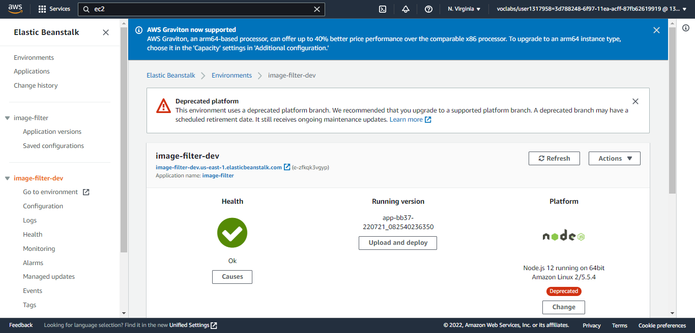

# Udagram Image Filtering Microservice

Udagram is a simple cloud application developed alongside the Udacity Cloud Engineering Nanodegree. It allows users to register and log into a web client, post photos to the feed, and process photos using an image filtering microservice.

[]

# Known issues
Requesting images with a redirect response will throw an error. This image filter can only request images with a direct response.  
https://github.com/oliver-moran/jimp/issues/775#issuecomment-527838035  
To fix, fork this git, and upgrade Jimp

### Run
Visit http://image-filter-dev.us-east-1.elasticbeanstalk.com/filteredimage?image_url=<<YOUR_IMAGE_URL>> to filter an image  
e.g. http://image-filter-dev.us-east-1.elasticbeanstalk.com/filteredimage?image_url=https://img.youtube.com/vi/PATlqs14eWc/0.jpg

